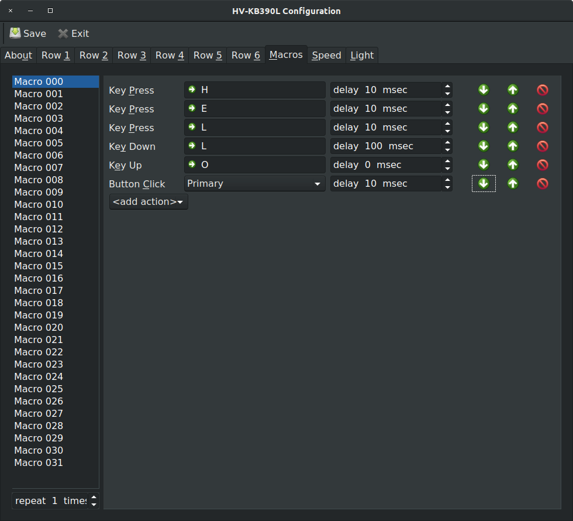

# hv-kb390l-config

## Introduction
HAVIT KB390L mechanical keyboard configuration utility.

This program **is not** an official utility from the product vendor.

It is strongly recommended to use the software from the official website:
http://www.havit.hk/downloads/

Use this utility only if your system is not supported by the manufacturer,
or if you need some extra features that the official software does not provide.

*Absolutely no warranty*. Perhaps (and in some cases definitely),
the device will be broken. 

## Installation
### Ubuntu

    sudo add-apt-repository ppa:pbludov/ppa && sudo apt-get update && sudo apt-get install hv-kb390l-config

### MacOS X (via homebrew)

    brew cask install https://raw.githubusercontent.com/pbludov/hv-kb390l-config/master/hv-kb390l-config.rb

### Windows (via chocolatey)

    cinst hv-kb390l-config

Also, binary packages are available in [releases](https://github.com/pbludov/hv-kb390l-config/releases).

## Building from sources
### Requirements
For compiling hv-kb390l-config yourself, you will need the QT (>= 5.2).
It is free and available at [http://www.qt.io]. You may also need its
dependency libraries and header files, such as libusb-1.0, hidapi-libusb.

Furthermore you need, of course, a C++ compiler and the Make tool.
The GNU versions of these tools are recommended, but not required.

### Making hv-kb390l-config with gcc/clang

    qmake
    make

### Making hv-kb390l-config with mingw

    qmake
    mingw32-make

### Making hv-kb390l-config with Visual Studio

    qmake
    nmake

### Building the DEB package (Debian/Ubuntu/Mint)
    
    dpkg-buildpackage -us -uc -I.git -rfakeroot

### Building the RPM package (Fedora/SUSE/CentOS)
    
    tar czf /tmp/hv-kb390l-config.tar.gz * --exclude=.git && rpmbuild -ta /tmp/hv-kb390l-config.tar.gz

### Building the MSI package (Windows)
    
    set CONFIGURATION=release
    windeployqt.exe --no-svg --no-angle --no-opengl-sw --no-system-d3d-compiler --no-translations --libdir qtredist --plugindir qtredist %CONFIGURATION%\hv-kb390l-config.exe
    heat dir qtredist -cg CG_QtRedist -var var.QtRedistDir -ag -srd -sfrag -dr INSTALLDIR -out qtredist.wxs
    candle -dConfiguration=%CONFIGURATION% -dQtRedistDir=qtredist hv-kb390l-config.wxs qtredist.wxs
    light hv-kb390l-config.wixobj qtredist.wixobj -out hv-kb390l-config.msi

### Building the DMG package (MacOS)

    macdeployqt hv-kb390l-config.app -dmg

## Galery

### License
hv-kb390l-config is distributed under the terms of the GNU General Public License
as published by the Free Software Foundation; either version 2.1 of the License,
or (at your option) any later version.  A copy of this license
can be found in the file COPYING included with the source code of this program.

&copy; 2018 Pavel Bludov <pbludov@gmail.com>

